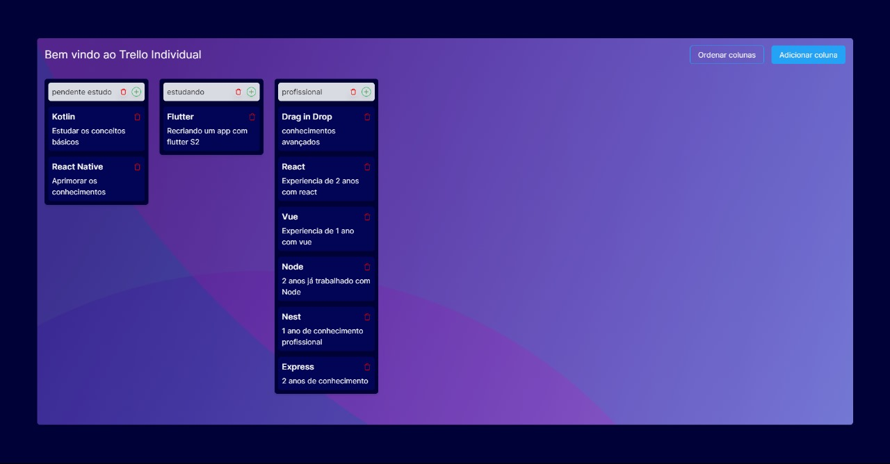

<h1 align="center"> Meu Trello Individual </h1>

<p align="center">

</p>

## Tecnologia 🚀
O projeto foi desenvolvido com as seguintes tecnologias:
- React
- Tailwind
- React-Beautiful-DnD

### Objetivo 🎯
- Recriar o sistema Trello com React e Tailwind
- Organizar as tarefas do dia a dia
- Mostrar que é não é tão difícil assim criar um sistema parecido com o Trello

### Funcionalidades 📌
- Adicionar novas colunas
- Adicionar novas tarefas
- Mover as tarefas entre as listas
- Remover as tarefas
- Remover as colunas
- Ordenar as tarefas dentro das colunas
- Ordenar as colunas

### Como rodar o projeto 🤔
```
# Clone o repositório
git clone https://github.com/Jwfelipee/my_trello.git

# Entre no diretório
cd my_trello

# Instale as dependências
npm ci

# Rode o projeto
npm start
```

## Vercel 🌐
Neste link você encontra o projeto hospedado na Vercel:
- [My Trello](https://my-trello-coral.vercel.app/)

## Autor 🧑🏽
Feito com ❤️ por:
- [João Wictor Felipe](https://github.com/Jwfelipee/)